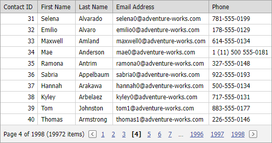

<!-- default badges list -->

<!-- default badges end -->

# Grid View for ASP.NET Web Forms - How to bind the grid to an ObjectDataSource and enable server-side paging
<!-- run online -->
**[[Run Online]](https://codecentral.devexpress.com/128537859/)**
<!-- run online end -->

The example demonstrates how to create [ObjectDataSource](https://learn.microsoft.com/en-us/previous-versions/57hkzhy5(v=vs.140)) with select parameters to allow ASPxGridView to perform paging and sorting using SQL queries to a database server.

The [ObjectDataSource](https://learn.microsoft.com/en-us/previous-versions/57hkzhy5(v=vs.140)) object supports `SelectCountMethod` and `SelectMethod` methods. Implement the methods to return the number of all records and records for the current page.

To enable server-side paging, set the [DataSourceForceStandardPaging](https://docs.devexpress.com/AspNet/DevExpress.Web.ASPxGridBase.DataSourceForceStandardPaging) property to `true`.

Note that in this case, our advanced paging capabilities are turned off and the following grid features are not supported: summary calculation, data grouping, data filtering, unbound data (unbound columns), compound (complex) properties, endless paging mode, and conditional formatting.

## Files to Review

* [Products.cs](./CS/WebSite/App_Code/Products.cs) (VB: [Products.vb](./VB/WebSite/App_Code/Products.vb))
* [Default.aspx](./CS/WebSite/Default.aspx) (VB: [Default.aspx](./VB/WebSite/Default.aspx))
